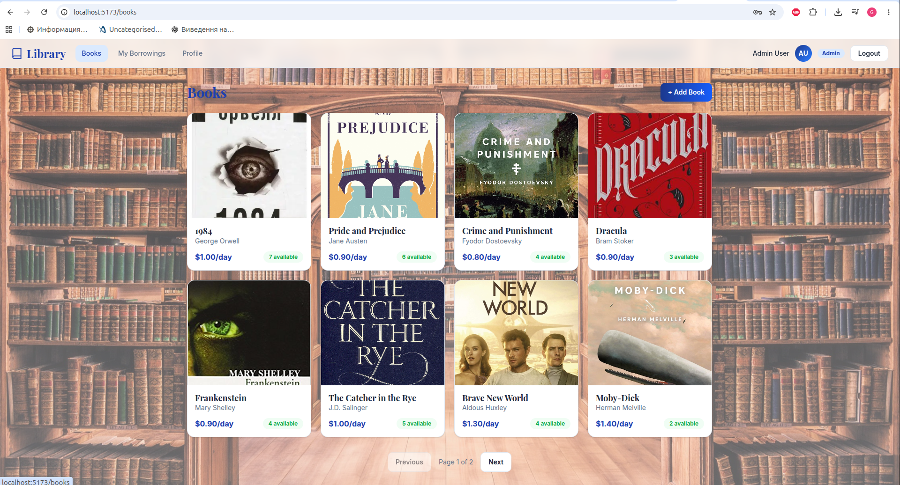
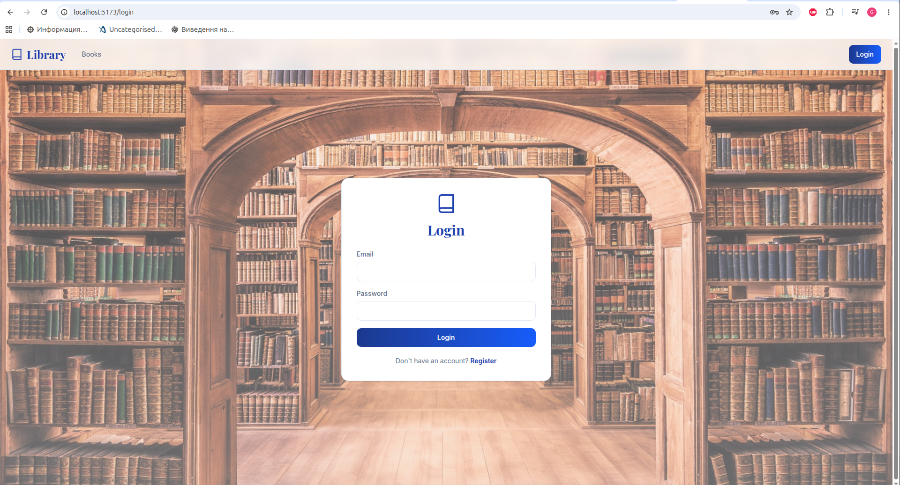
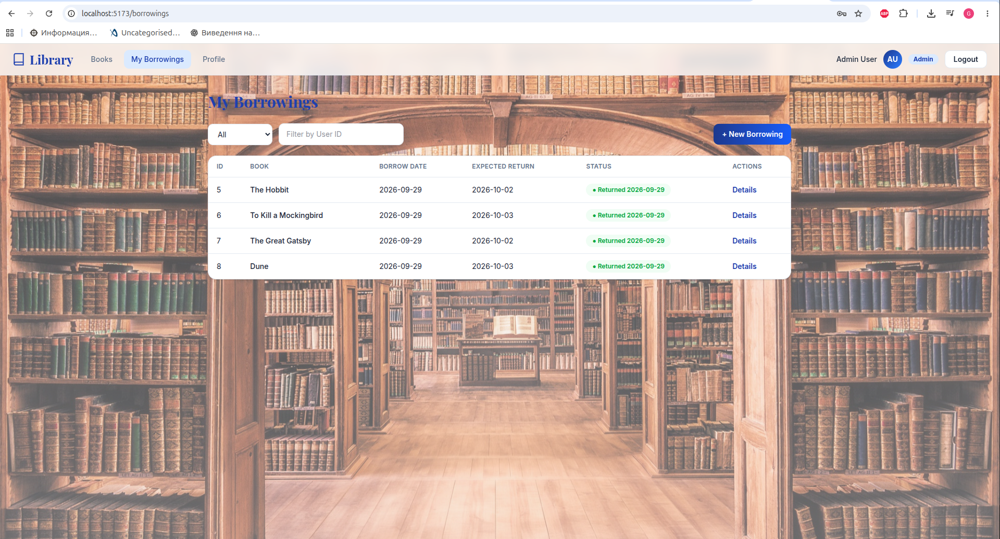
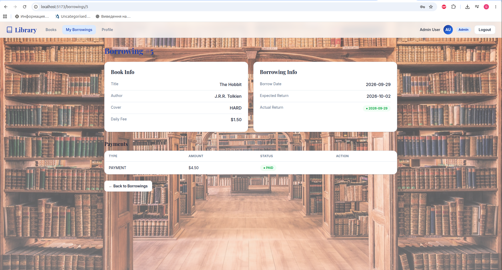
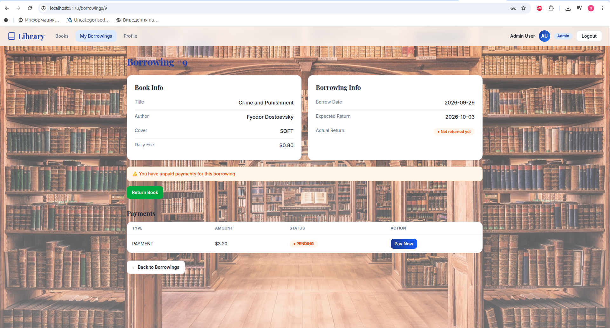
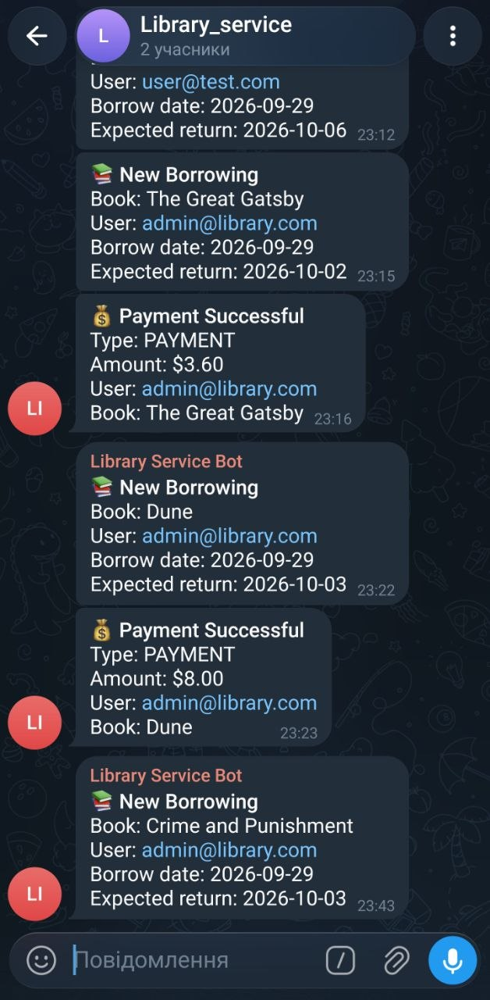
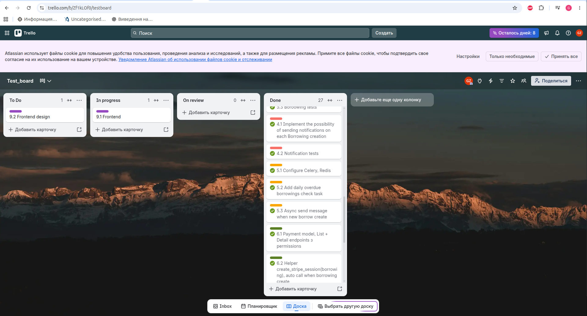

# Library Service API

Online management system for book borrowings — REST API built with Django REST Framework + React frontend.

## Features

- JWT authentication with custom `Authorize` header
- Books inventory management (CRUD) with cover image upload
- Borrowing system with automatic inventory tracking
- Stripe payment integration (payments and fines) with webhook confirmation
- Telegram notifications (new borrowings, overdue alerts)
- Scheduled daily overdue check via Celery Beat
- Pending payment check before new borrowing
- Swagger/OpenAPI documentation
- Public `/api/stats/` endpoint (available copies, active readers, total borrowings)
- `seed_db` management command with sample books, users and cover images
- React SPA frontend (Tailwind CSS, dark mode, 3D book carousel)

## Tech Stack

### Backend
- Python 3.12 / Django 6.x / Django REST Framework
- PostgreSQL
- Redis (Celery broker)
- Celery + Celery Beat (async tasks, scheduling)
- Gunicorn + WhiteNoise (production server and static files)
- Pillow (book images)
- Stripe API (payments)
- Telegram Bot API (notifications)
- drf-spectacular (Swagger)
- Docker + docker-compose

### Frontend
- React 19 + TypeScript
- Vite
- Tailwind CSS 4
- Axios (API client with JWT auto-refresh)
- React Router

## Getting Started

### Prerequisites

- Docker and Docker Compose
- Node.js 18+ (for frontend development)
- Stripe account (test mode) — [dashboard.stripe.com](https://dashboard.stripe.com)
- Telegram bot token — create via [@BotFather](https://t.me/BotFather)

### Development mode (default)

Uses `config.settings.dev` (`DEBUG=True`), Django's `runserver` with auto-reload,
the project directory is mounted into the containers.

1. Clone the repository:
```bash
git clone https://github.com/Gennadiy-Zubariev/library-service.git
cd library-service
```

2. Create `.env` file from sample:
```bash
cp .env_sample .env
```

3. Fill in your `.env`:
```env
DJANGO_SECRET_KEY=your-secret-key
POSTGRES_DB=library_db
POSTGRES_USER=library_user
POSTGRES_PASSWORD=library_password
POSTGRES_HOST=db
POSTGRES_PORT=5432
CELERY_BROKER_URL=redis://redis:6379/0
DJANGO_SETTINGS_MODULE=config.settings.dev
STRIPE_SECRET_KEY=sk_test_xxxxxxxxxxxxx
STRIPE_WEBHOOK_SECRET=whsec_xxxxxxxxxxxxx
TELEGRAM_BOT_TOKEN=your-bot-token
TELEGRAM_CHAT_ID=your-chat-id
```

4. Build and run backend (`docker-compose.yaml`, dev settings are set explicitly there):
```bash
docker compose up --build
```

5. Fill the database with sample data (optional, see [Seeding the database](#seeding-the-database)):
```bash
docker compose exec web python manage.py seed_db
```
Or create only a superuser:
```bash
docker compose exec web python manage.py createsuperuser
```

6. Run frontend (in a separate terminal):
```bash
cd frontend
npm install
npm run dev
```

The API is available at `http://localhost:8000/api/`
The frontend is available at `http://localhost:5173/`

### Production mode

Uses `config.settings.prod` (`DEBUG=False`, `ALLOWED_HOSTS` taken from the environment),
Gunicorn (3 workers) instead of `runserver`, static files served by WhiteNoise, no code
mounted into the containers. It is a separate stack: `docker-compose.prod.yaml` + `.env.prod`.

1. Create `.env.prod` from the sample (it is git-ignored, never commit it):
```bash
cp .env.prod_sample .env.prod
```

2. Fill in `.env.prod`. The important differences from `.env`:
```env
DJANGO_SECRET_KEY=<long random value, not "django-insecure-...">
DJANGO_SETTINGS_MODULE=config.settings.prod
DJANGO_ALLOWED_HOSTS=example.com,www.example.com   # comma separated, no spaces, no http://
DJANGO_HTTPS=False                                 # True only when served over HTTPS
DJANGO_SERVE_MEDIA=True                            # Django serves /media/ (book covers)
POSTGRES_PASSWORD=<strong password>
STRIPE_SECRET_KEY=sk_live_xxxxxxxxxxxxx
```
`DJANGO_ALLOWED_HOSTS` and all `POSTGRES_*` variables are required: the app refuses to start
without them. Generate a secret key with
`python -c "import secrets; print(secrets.token_urlsafe(64))"` (avoid `$`, `#` and quotes
in values: Docker Compose interprets them in env files).

3. Stop the development stack (both use port 8000), then build and run:
```bash
docker compose down
docker compose -f docker-compose.prod.yaml up --build -d
```
On start the `web` container applies migrations, collects static files and starts Gunicorn.

4. Create an admin user (the production stack has its own database and volumes):
```bash
docker compose -f docker-compose.prod.yaml exec web python manage.py createsuperuser
```

Other useful commands:
```bash
docker compose -f docker-compose.prod.yaml logs -f web
docker compose -f docker-compose.prod.yaml down        # stop (data is kept in volumes)
```

`DJANGO_HTTPS=True` enables HTTPS redirect, secure cookies and HSTS. Turn it on only behind a
reverse proxy with a TLS certificate that sets `X-Forwarded-Proto` (nginx, Caddy, a cloud load
balancer). Without HTTPS it would break login. Check the configuration with:
```bash
docker compose -f docker-compose.prod.yaml exec web python manage.py check --deploy
```

Uploaded media (`/media/`, book covers) is served by Django itself in production when
`DJANGO_SERVE_MEDIA=True` (the default). It is simple but slow, fine for a demo. For real traffic
set `DJANGO_SERVE_MEDIA=False` and serve the `media_data_prod` volume with nginx or use object
storage such as S3. TLS termination is not covered here either: use a reverse proxy.

### Choosing the mode

| | Development | Production |
|---|---|---|
| Compose file | `docker-compose.yaml` | `docker-compose.prod.yaml` |
| Env file | `.env` | `.env.prod` |
| Settings | `config.settings.dev` | `config.settings.prod` |
| Web server | `runserver` (auto-reload) | Gunicorn |
| `DEBUG` / `ALLOWED_HOSTS` | `True` / `*` | `False` / from `DJANGO_ALLOWED_HOSTS` |
| Static files | served by `runserver` | WhiteNoise after `collectstatic` |
| Code | mounted from the host | baked into the image |
| Database volume | `postgres_data` | `postgres_data_prod` (separate) |

The settings module is chosen by the `DJANGO_SETTINGS_MODULE` environment variable. `manage.py`
defaults to `dev`; `wsgi.py`, `asgi.py` and `celery.py` default to `prod`, so a server started
without the variable never runs with `DEBUG=True`.

## Seeding the database

```bash
docker compose exec web python manage.py seed_db          # add sample data
docker compose exec web python manage.py seed_db --flush  # delete all books first
```

The command is idempotent (books are matched by title + author) and creates:

- 16 books
- admin: `admin@library.com` / `admin12345`
- reader: `user@library.com` / `user12345`

### Book cover images

Put images into `books/seed_images/`. The file name (any of `.jpg`, `.jpeg`, `.png`, `.webp`)
must match the book slug, e.g. `the-hobbit.jpg`, `1984.webp`, `dune.png`.
Books without an image get a colored gradient cover, and the command lists the missing files.
Run `seed_db` again after adding images: they are attached to books that have none yet.

The list of books and their file names is the `BOOKS` array in
`books/management/commands/seed_db.py`.

## Media files

Uploaded book images are stored in `media/` (`MEDIA_URL=/media/`, served by Django when
`DEBUG=True`; in production by `DJANGO_SERVE_MEDIA=True`, see
[Production mode](#production-mode)). The Vite dev server proxies both `/api` and `/media` to the backend.
Admins can upload an image on the Add Book / Edit Book pages (multipart form data).

## API Endpoints

### Users
| Method | Endpoint | Description | Access |
|--------|----------|-------------|--------|
| POST | /api/users/register/ | Register new user | Public |
| POST | /api/users/token/ | Get JWT tokens | Public |
| POST | /api/users/token/refresh/ | Refresh access token | Public |
| GET | /api/users/me/ | Get profile | Authenticated |
| PUT/PATCH | /api/users/me/ | Update profile | Authenticated |

### Books
| Method | Endpoint | Description | Access |
|--------|----------|-------------|--------|
| GET | /api/books/ | List books | Public |
| GET | /api/books/\<id\>/ | Book detail | Public |
| POST | /api/books/ | Create book (multipart, optional `image`) | Admin |
| PUT/PATCH | /api/books/\<id\>/ | Update book | Admin |
| DELETE | /api/books/\<id\>/ | Delete book | Admin |

Book fields: `id`, `title`, `author`, `cover` (`HARD`/`SOFT`), `inventory`, `daily_fee`, `image` (URL or `null`).

### Stats
| Method | Endpoint | Description | Access |
|--------|----------|-------------|--------|
| GET | /api/stats/ | `books_available` (total copies in stock), `active_readers` (users with unreturned books), `borrowings_total` | Public |

### Borrowings
| Method | Endpoint | Description | Access |
|--------|----------|-------------|--------|
| GET | /api/borrowings/ | List borrowings | Authenticated |
| GET | /api/borrowings/\<id\>/ | Borrowing detail | Authenticated |
| POST | /api/borrowings/ | Create borrowing | Authenticated |
| POST | /api/borrowings/\<id\>/return/ | Return book | Authenticated |

Borrowing list supports filtering:
- `?is_active=true` — only active (not returned) borrowings
- `?user_id=1` — filter by user (admin only; non-numeric values are ignored)

### Payments
| Method | Endpoint | Description | Access |
|--------|----------|-------------|--------|
| GET | /api/payments/ | List payments | Authenticated |
| GET | /api/payments/\<id\>/ | Payment detail | Authenticated |
| GET | /api/payments/success/?session_id=... | Confirm payment (own payments only, otherwise 404) | Authenticated |
| POST | /api/payments/webhook/ | Stripe webhook (signature-verified) | Stripe only |
| GET | /api/payments/cancel/ | Cancel payment | Authenticated |

## Stripe webhook

A payment is marked PAID by two independent paths, so it is not lost if the user closes the
tab before the redirect to the success page:

1. **Success page** — `GET /api/payments/success/?session_id=...` (instant feedback for the user)
2. **Webhook** — Stripe calls `POST /api/payments/webhook/` on the `checkout.session.completed` event

Both use the same atomic `PENDING → PAID` switch, so the Telegram notification is sent only once
even if both paths fire or Stripe redelivers the event. The webhook verifies the
`Stripe-Signature` header with `STRIPE_WEBHOOK_SECRET` and returns `400` for an invalid or
missing signature.

### Local development

The webhook needs to be reachable by Stripe, so forward events with the
[Stripe CLI](https://docs.stripe.com/stripe-cli):

```bash
stripe login
stripe listen --forward-to localhost:8000/api/payments/webhook/
```

The CLI prints `Ready! Your webhook signing secret is whsec_...` — put it into `.env` as
`STRIPE_WEBHOOK_SECRET` and restart the backend (`docker compose up -d web`).

### Production

In the Stripe Dashboard: **Developers → Webhooks → Add endpoint**, URL
`https://<your-domain>/api/payments/webhook/`, event `checkout.session.completed`.
Use the endpoint's own *Signing secret* as `STRIPE_WEBHOOK_SECRET` (it differs from the
Stripe CLI secret and from `STRIPE_SECRET_KEY`).

## Authentication

The API uses JWT tokens with a custom header `Authorize` (not the standard `Authorization`).

1. Get tokens: `POST /api/users/token/` with `{"email": "...", "password": "..."}`
2. Use access token: add header `Authorize: Bearer <access_token>`
3. Refresh: `POST /api/users/token/refresh/` with `{"refresh": "<refresh_token>"}`

## Borrowing & Payment Flow

1. User creates a borrowing → book inventory decreases by 1
2. Stripe Checkout session is created automatically → Payment (PENDING)
3. User clicks **Pay Now** (Stripe opens in the same tab) and pays → Payment becomes PAID
   (via the Stripe webhook, or when the user lands on the success page — whichever comes first)
4. User returns the book → inventory increases by 1
5. If returned late → a FINE payment is created (daily_fee × days_overdue × 2)

Users cannot create new borrowings while they have pending payments.

## Notifications

Telegram notifications are sent for:
- New borrowing created
- Overdue borrowings (daily check at 9:00)
- Successful payment (sent once per payment)

## Frontend Pages

| Page | URL | Description |
|------|-----|-------------|
| Home | / | Hero, 3D carousel of books, live library stats |
| Login | /login | Email + password authentication |
| Register | /register | New user registration |
| Books | /books | Grid of book cards with covers (public) |
| Book Detail | /books/:id | View/edit/delete book (admin) |
| Add Book | /books/create | Create new book with image (admin) |
| My Borrowings | /borrowings | List with active/user filters |
| New Borrowing | /borrowings/create | Select book + return date (`?book=<id>` preselects a book) |
| Borrowing Detail | /borrowings/:id | Details, return, payments |
| Profile | /profile | View/edit user profile |
| Payment Success | /payments/success | Stripe payment confirmation |
| Payment Cancel | /payments/cancel | Payment postponed message |

## Screenshots

### Home


### Books


### Login


### Book detail


### Add book (admin)


### My borrowings


### Borrowing detail


### Borrowing detail with pending payment


### Profile


### Telegram notifications


### Project board (Trello)


## API Documentation

- Swagger UI: `http://localhost:8000/api/swagger/`
- ReDoc: `http://localhost:8000/api/redoc/`

## Running Tests

```bash
python manage.py test
```

With coverage:
```bash
coverage run --source='.' manage.py test
coverage report --show-missing
```

## Frontend customization

- Site background: put an image at `frontend/public/bg.jpg` (see `body` in `frontend/src/index.css`).
- Dark mode follows the system theme (`prefers-color-scheme`).

## Architecture

```
Frontend (React SPA, port 5173)
  ↓ Axios + JWT
Backend (Django REST Framework, port 8000)
├── Users Service      — authentication, registration
├── Books Service      — book inventory CRUD
├── Borrowings Service — borrow/return books
├── Payments Service   — Stripe integration
└── Notifications      — Telegram bot

Celery Worker ← Redis ← Celery Beat
└── Async Telegram notifications
└── Daily overdue check (9:00)

PostgreSQL — data storage
Redis — message broker
```

## Docker Services

| Service | Description |
|---------|-------------|
| web | Django application (`runserver` in dev, Gunicorn in prod) |
| db | PostgreSQL 16 |
| redis | Redis 7 (Celery broker) |
| celery_worker | Executes async tasks |
| celery_beat | Schedules periodic tasks |

## Test Stripe Card

For testing payments use: `4242 4242 4242 4242`, any future expiry, any CVC.
